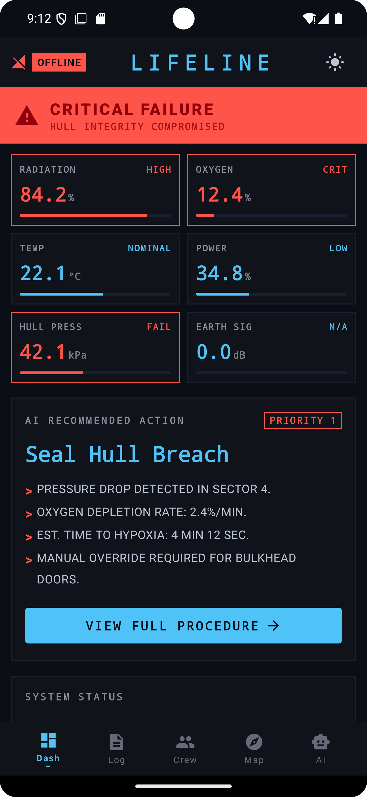
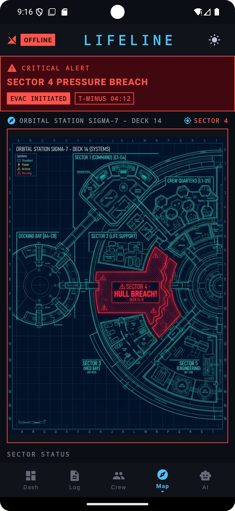
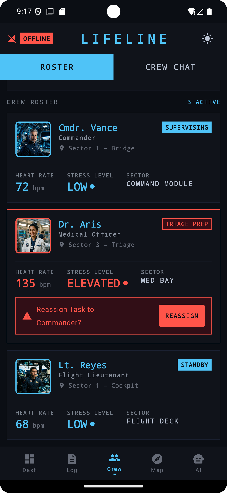
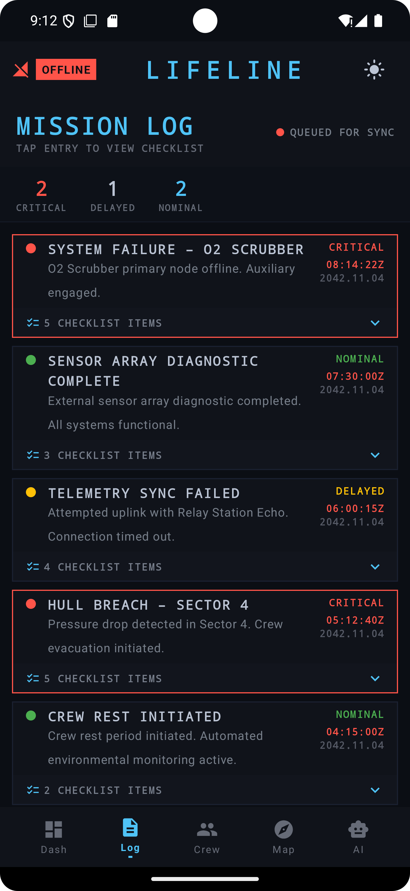
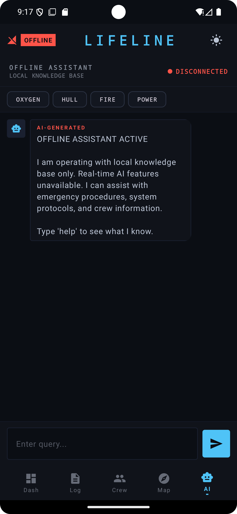
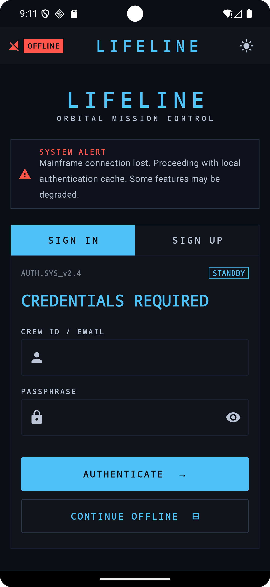
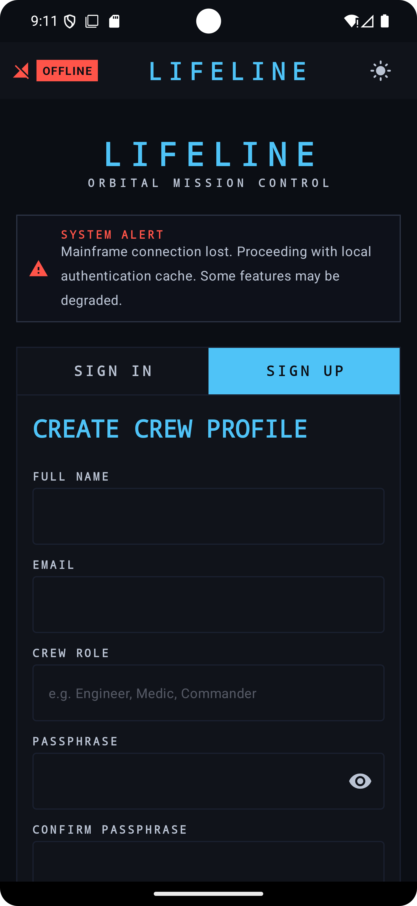

# Lifeline Space App AI 🚀

Lifeline is a comprehensive web and mobile application designed for space crews and astronauts. It serves as a centralized hub for monitoring mission-critical information, crew health, procedures, and navigation. 

## 📸 Previews

<div align="center">
  
  
  
  
  
  
  
  
  
  
  
</div>

---

## 🌟 What it does
Lifeline provides an integrated dashboard for space crews to manage their daily operations. It features a suite of tools including:
* **Dashboard**: An overview of critical mission stats and connection status.
* **Procedures**: Step-by-step guides for technical and medical procedures.
* **Crew Management**: Real-time monitoring of crew members' health and vitals.
* **Navigation Map**: Advanced navigation and location tracking in space and on-planet.
* **AI Assistant**: An intelligent assistant powered by AI to help with queries, analysis, and troubleshooting.
* **Communication**: Integrated chat for crew coordination.
* **Log**: A system for mission logging and reporting.

## 🛠 The problem it solves
During space missions, astronauts face extreme isolation, complex technical challenges, and communication delays with Earth. Managing procedures, monitoring health, and resolving unexpected issues requires a robust, autonomous system that can function even when offline or experiencing delayed connectivity. Lifeline serves as the ultimate offline-capable, autonomous bridge between the crew and mission success.

## 🤖 How AI helps
The integrated AI Assistant serves as an autonomous support system for the crew. It helps astronauts by:
* Quickly retrieving and explaining complex procedures.
* Assisting in troubleshooting technical anomalies when communication with mission control is delayed or lost.
* Providing immediate guidance on medical or mission-critical logs.
* Acting as a reliable co-pilot that can process information locally and efficiently.

## 🚀 How to use

### Web Application
The web app is built with React and Vite.

1. Navigate to the web directory:
   ```bash
   cd lifeline-web
   ```
2. Install dependencies:
   ```bash
   npm install
   ```
3. Run the development server:
   ```bash
   npm run dev
   ```

### Android Application
The mobile app is built with Kotlin and Jetpack Compose.

1. Open the repository root folder in Android Studio.
2. Let Gradle sync the project dependencies.
3. Build and run the app on an emulator or physical Android device.
